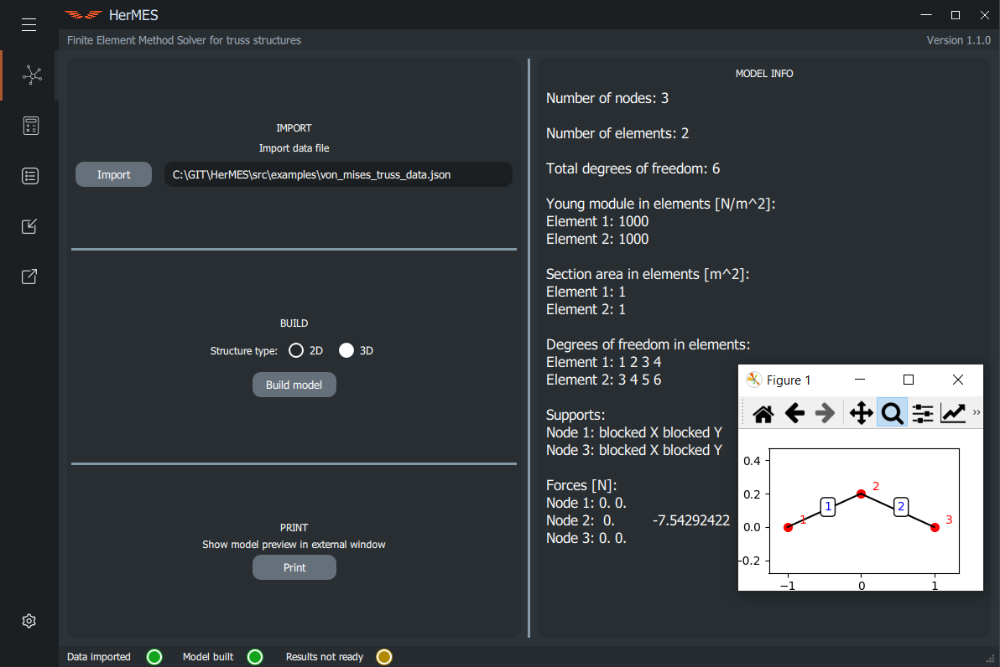
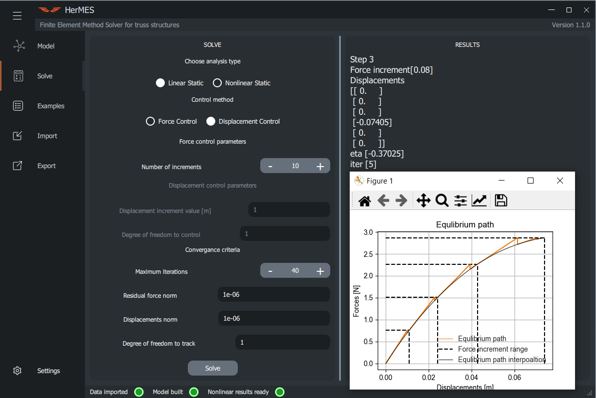

<a name="readme-top"></a>

<div align="center">

[![Contributors][contributors-shield]][contributors-url] [![Forks][forks-shield]][forks-url] [![Stargazers][stars-shield]][stars-url] [![Issues][issues-shield]][issues-url] [![MIT License][license-shield]][license-url] [![LinkedIn][linkedin-shield]][linkedin-url]

</div>


<!-- PROJECT LOGO -->
<br />
<div align="center">
  <a href="https://github.com/vanderAries/HerMES">
    
  </a>


  <p align="center">
  <br />
    HerMES is a FEM calculation engine (solver) with GUI for linear and nonlinear trusses. It has validation examples and is able to import every 2D or 3D structure using specific JSON format.
    <br />
    <a href="https://github.com/vanderAries/HerMES"><strong>Explore the docs »</strong></a>
    <br />
    <br />
    <a href="https://github.com/vanderAries/HerMES">View Demo</a>
    ·
    <a href="https://github.com/vanderAries/HerMES/issues">Report Bug</a>
    ·
    <a href="https://github.com/vanderAries/HerMES/issues">Request Feature</a>
  </p>
</div>


<!-- TABLE OF CONTENTS -->
<details>
  <summary>Table of Contents</summary>
  <ol>
    <li>
      <a href="#about-the-project">About The Project</a>
      <ul>
        <li><a href="#built-with">Built With</a></li>
      </ul>
    </li>
    <li>
      <a href="#getting-started">Getting Started</a>
      <ul>
        <li><a href="#prerequisites">Prerequisites</a></li>
        <li><a href="#installation">Installation</a></li>
      </ul>
    </li>
    <li><a href="#usage">Usage</a></li>
    <li><a href="#roadmap">Roadmap</a></li>
    <li><a href="#contributing">Contributing</a></li>
    <li><a href="#license">License</a></li>
    <li><a href="#contact">Contact</a></li>
    <li><a href="#acknowledgments">Acknowledgments</a></li>
  </ol>
</details>


<!-- ABOUT THE PROJECT -->
## About The Project

- Github username: [vanderAries][git-username-url]
- Repository name: [HerMES](git-repo-url)
- Linkedin username: [@gp-bak](linkedin-url)
- Email: gp.bak96@gmail.com
- Project Title: **HerMES** FEM Solver

The project was created during my master thesis with great help of my thesis supervior [Roman Putanowicz](https://github.com/putanowr).


<p align="right">(<a href="#readme-top">back to top</a>)</p>


### Built With

This project was build with [Python v. 3.10.6](https://www.python.org/downloads/release/python-3106/) and Python libraries shown below. All dependencies are in file `requirements.txt`.

- #### QT for Pyton (PySide)
  [][PySide-url]

- #### NumPy
  [][NumPy-url]

- #### SciPy
  [][SciPy-url]

- #### Matplotlib
  [][Matplotlib-url]

<p align="right">(<a href="#readme-top">back to top</a>)</p>


<!-- GETTING STARTED -->
## Getting Started

To get a local copy of HerMES up and running follow these simple example steps.

### Prerequisites

To run the program install Python at least version [3.10.6](https://www.python.org/downloads/release/python-3106/).

### Installation

- First, start by cloning the repository:

```sh
git clone https://github.com/vanderAries/HerMES.git
```

- Access the project folder
```sh
cd HerMES
```
I recommend to use Python virtual environment e.g. built in `venv` for development:

- Create a virtual environment
```sh
python -m venv .venv
```

- Enable the virtual environment
  - on Windows Powershell
  ```powershell
  .\.venv\Scripts\activate.bat
  ```
  - on Mac/Linux
  ```sh
  source .venv/bin/activate
  ```

- Install the Python dependencies on the virtual environment
```sh
python -m pip install -r requirements.txt
```
- Access the source folder
```sh
cd src
```

- Start the program
```sh
python main.py
```


<p align="right">(<a href="#readme-top">back to top</a>)</p>


<!-- USAGE EXAMPLES -->
## Usage

Program HerMES can be use to analyze truss structures using FEM. Either with 2D or 3D geometry. There are two types of analysis: linear (suitable for small displacements) and nonlinear (suitable for big displacements) with force and displacement control method.

Main GUI page with Von Mises Truss book example:
<div align="center">
  
</div>

Solver GUI page with analysis setting, results and equilibrium path.

<div align="center">
  
</div>

This section will be developed and updated in the future. For now, try it yourself!

<p align="right">(<a href="#readme-top">back to top</a>)</p>


<!-- PROJECT ORGANIZATION -->
## Project Organization


    ├── README.md                 <- The top-level README for developers using this project.
    ├── .gitignore                <- File for ignoring the folders/files in repository.
    ├── requirements.txt          <- File for dependencies installation (Python libraries)
    ├── images                    <- Images for README
    └── src                       <- Source folder
        │
        ├── data                  <- Folder for non-book JSON examples
        ├── data_exchange         <- Folder for import/export module
        │   │
        │   ├── export.py         <- 2D/3D model converter, JSON results export
        │   └── model_import.py   <- JSON model import
        │
        ├── examples              <- Folder for book examples in JSON
        ├── images                <- Images for GUI
        ├── qml                   <- GUI in QML language (QT Quick)
        │   │
        │   ├── controls          <- Buttons, bars and other GUI elements
        │   ├── pages             <- GUI pages like: model, solver, examples, export etc.
        │   └── main.qml          <- main page of HerMES
        │
        ├── results               <- Folder for example results
        ├── structure             <- Folder with solver and plotter functionality and FEM matrix models
        └── main.py               <- main file to run HerMES
    
--------

<!-- ROADMAP -->
## Roadmap

- [x] GUI

- [ ] 2D Analysis
  - [x] Linear
  - [ ] Nonlinear
    - [x] Force Method
    - [ ] Displacement Method
      - [x] Book cases
      - [ ] Every cases

- [ ] 3D Analysis
  - [x] Linear
  - [ ] Nonlinear
    - [ ] Force Method
      - [x] Book cases
      - [ ] Every cases
    - [ ] Displacement Method
      - [x] Book cases
      - [ ] Every cases

- [x] Import
- [x] Export
- [ ] Pre-processor
- [ ] Post-processor
- [ ] Units converter

See the [open issues](https://github.com/vanderAries/HerMES/issues) for a full list of proposed features (and known issues).

<p align="right">(<a href="#readme-top">back to top</a>)</p>


<!-- CONTRIBUTING -->
## Contributing

Contributions are what make the open source community such an amazing place to learn, inspire, and create. Any contributions you make are **greatly appreciated**.

If you have a suggestion that would make this better, please fork the repo and create a pull request. You can also simply open an issue with the tag "enhancement".
Don't forget to give the project a star! Thanks again!

1. Fork the Project
2. Create your Feature Branch (`git checkout -b feature/AmazingFeature`)
3. Commit your Changes (`git commit -m 'Add some AmazingFeature'`)
4. Push to the Branch (`git push origin feature/AmazingFeature`)
5. Open a Pull Request

<p align="right">(<a href="#readme-top">back to top</a>)</p>


<!-- LICENSE -->
## License

Distributed under the MIT License. See `LICENSE` file for more information.

<p align="right">(<a href="#readme-top">back to top</a>)</p>


<!-- CONTACT -->
## Contact

Paweł Bąk - gp.bak96@gmail.com

Project Link: [https://github.com/vanderAries/HerMES](https://github.com/vanderAries/HerMES)

<p align="right">(<a href="#readme-top">back to top</a>)</p>


<!-- ACKNOWLEDGMENTS -->
## Acknowledgments

* [Roman Putanowicz](https://github.com/putanowr)
* [Mateusz Orzeł](https://github.com/OrliczM)
* [Jakub Pietrzak](https://github.com/PKuba)

<p align="right">(<a href="#readme-top">back to top</a>)</p>


<!-- MARKDOWN LINKS & IMAGES -->
<!-- https://www.markdownguide.org/basic-syntax/#reference-style-links -->

[contributors-shield]: https://img.shields.io/github/contributors/vanderAries/HerMES.svg?style=for-the-badge
[contributors-url]: https://github.com/vanderAries/HerMES/graphs/contributors

[forks-shield]: https://img.shields.io/github/forks/vanderAries/HerMES.svg?style=for-the-badge
[forks-url]: https://github.com/vanderAries/HerMES/network/members

[stars-shield]: https://img.shields.io/github/stars/vanderAries/HerMES.svg?style=for-the-badge
[stars-url]: https://github.com/vanderAries/HerMES/stargazers

[issues-shield]: https://img.shields.io/github/issues/vanderAries/HerMES.svg?style=for-the-badge
[issues-url]: https://github.com/vanderAries/HerMES/issues

[license-shield]: https://img.shields.io/github/license/vanderAries/HerMES.svg?style=for-the-badge
[license-url]: https://github.com/vanderAries/HerMES/blob/main/LICENSE.txt

[linkedin-shield]: https://img.shields.io/badge/-LinkedIn-black.svg?style=for-the-badge&logo=linkedin&colorB=555
[linkedin-url]: https://www.linkedin.com/in/gp-bak/

[git-repo-url]: https://github.com/vanderAries/HerMES
[git-username-url]: https://github.com/vanderAries

[PySide-url]: https://doc.qt.io/qtforpython/
[NumPy-url]: https://numpy.org/
[SciPy-url]: https://scipy.org/
[Matplotlib-url]: https://matplotlib.org/